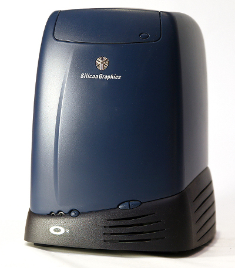
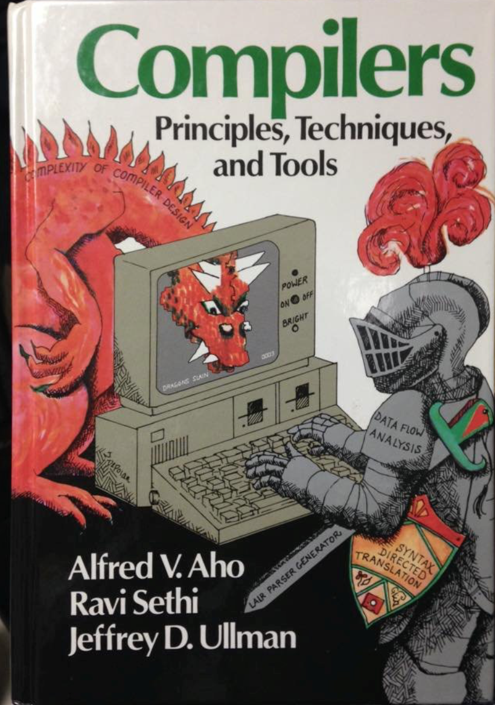
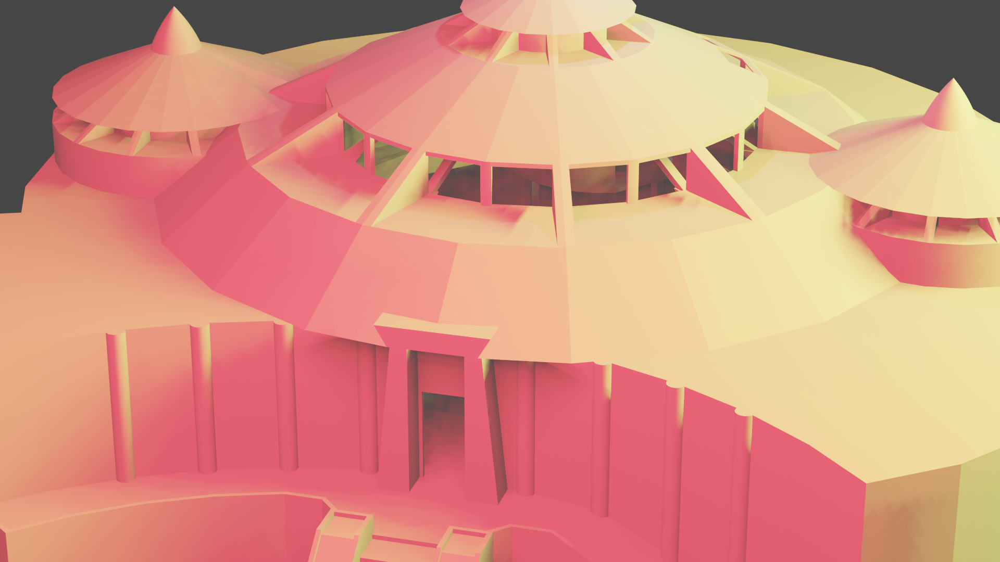
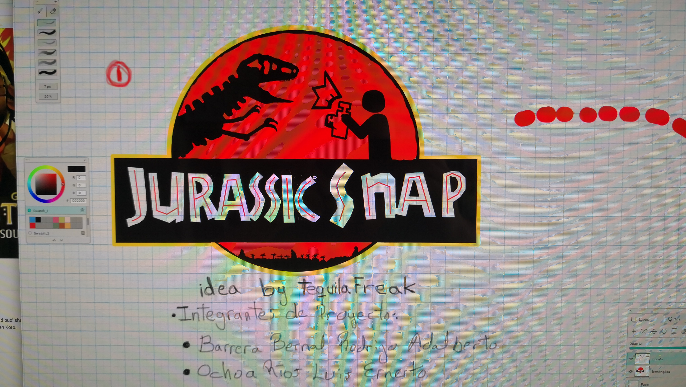
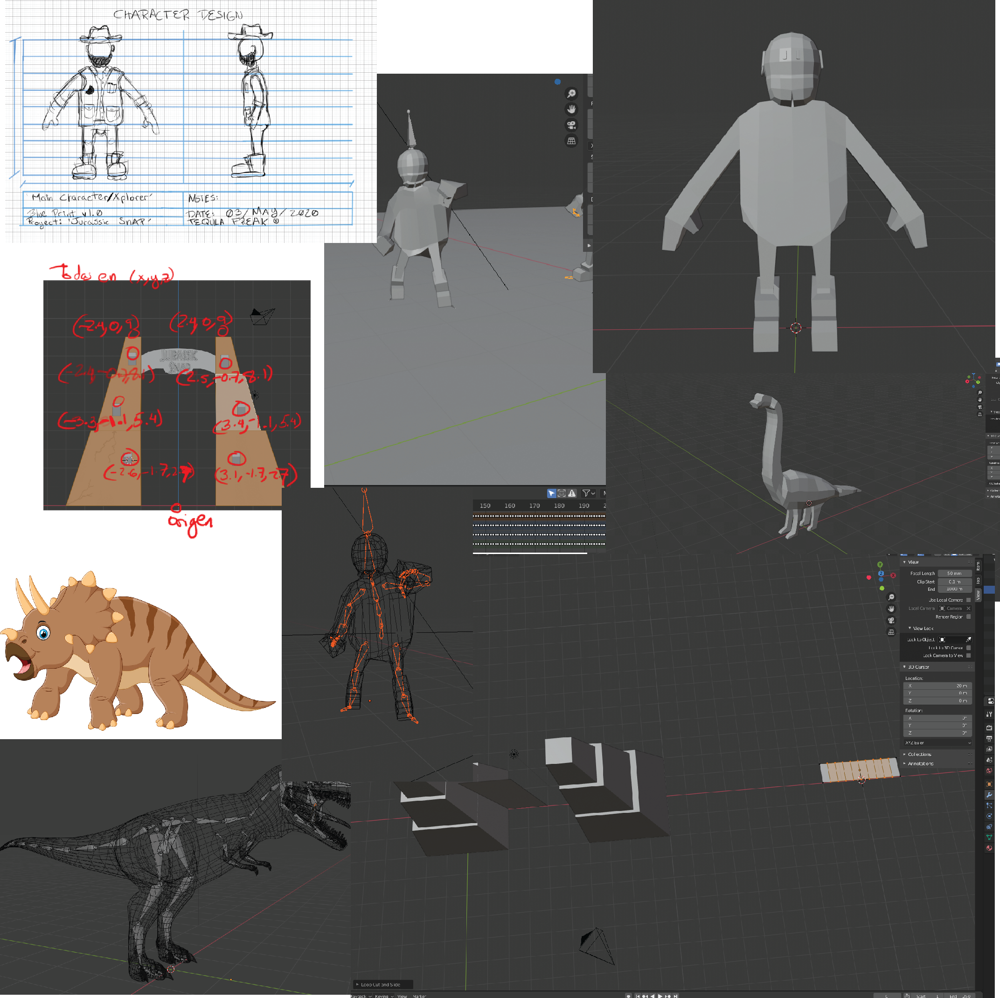

Reporte del Proyecto Final 
-

Descripción del documento: 
-

Éste documento contiene un especie de bitácora en la cuál se describe de donde se obtuvieron todos los recursos para la creación del proyecto, además de que se detalla en las dificultades de la realización del mismo.

No pretende ser una tesis, pero si una manera de llevar un control sobre lo que se estuvo realizando. Además de que es un recurso para futuros proyectos, pretende que se pongan observaciones acerca de las dificultades para no errar mucho en futuras producciones.

Contenido: 
-

**Introducción:**

En un breve contexto Parque Jurásico es un referente para hablar de Gráficos por Computadora. No sólamente eso, muchas personas que crecimos en la época y vimos la película en el cine, vimos también cómo promocionaban la película hasta en los noticiarios. Goza de ser de las primeras y pioneras películas en usar gráficos por computadora y no solamente eso, sucede que utiliza una de las primeras versiones de la interfaz que utilizamos en la asignatura, OpenGL. La interfaz con más de 250 funciones diferentes que hizo posible llevar a 'Mario Bros' al mundo de la tercera dimensión y la que puso en el mapa a Rare, como un fuerte competidor entre las compañías de videojuegos de la época. Al igual que nos trajo animales que vivieron millones y millones de años atrás. Si se investiga un poco en un video de youtube[^1] se ve una cronología de películas con Dinosaurios y se nota una gran diferencia cuando Jurassic Park entra al quite. 

[^1]: Esto es una nota al pie de página.

    

Fué en éstas circunstancias y en una máquina que parece de otro mundo o en todo caso un juguete muy caro, donde nace una de las franquicias mayor valuadas hoy día, con proyectos en puerta como el de Dreamworks para Netflix o su próxima película para estrenar, una franquicia que le ha dado a Studios Universal dinero de una forma imprecedente. Los dinosaurios llegaron para quedarse y es una de esas cosas que nos siguen fascinando, tan así es el asunto, que en portadas de libros de programación están muy presentes y en muchos de los cuales, se aprenden temas complejos, sin embargo, son conocidos por todos los Nerds a los que les gusta de programar, como los libros de los Dinosaurios.

    

 
 **Pókemon SNAP** es otra de nuestras influencias, éste ya tiene 21 años de ser publicado en Japón y 20 en el resto de las latitudes y hasta hace unos momentos a la fecha de la modificación de este documento, no había tenido secuela, hoy 17 de Junio de 2020 se acaba de anunciar 'New Pokemon Snap' para el Nintendo Switch. (Parte de la desmotivación de un miembro del equipo) Nintendo llevaba años sin renovar la serie y muchos queríamos volver a tener la experiencia Pokemon Snap. Desde Wii U creo que los fans ya se lo estaban pidiendo a Nintendo, pero no ejecutaron hasta ahora. Pensándolo bien, lo más seguro es que desde Wii U los mismos programadores de Nintendo, ya habrían hecho el pitch a sus colegas, no fué hasta éstos días que están poniendo manos a la obra ya que el trailer aún dice: 'Under Construction'. La lección de esto es el Timing, el timing lo es todo.
 

 
En este contexto, en ese mundo en el que estamos sumergidos y esa fascinación por nuestros amigos los dinosaurios fué que se diseño el siguiente proyecto. La franquicia ha dado para comer a muchas personas desde hace 25 años y da de comer a muchos en el presente. Y a como se ve, darán de comer a muchos en el futuro, ni sabía que Lego tenía ya un juego en 'Wii U' con los personajes de la franquicia. Por eso es franquicia, como Star Wars, las historias en esos mundos no se acaban por que hay muchas por contar.

El reto es grande ya que es repasar conceptos no sólo de programación (véase Gráfica anexa), hay que aprender a utilizar una de las API's más complejas en el mercado, cambiar un paradigma o estilo de  programación al que se nos acostumbra (y lo digo porque no es lo mismo <b>OpenGL</b> a <b>Modern OpenGL</b>, el cuál se nos introduce en la materia antescedente a ésta), el pipeline de renderizado cambia y por mucho. Sin embargo, ha sido uno de los proyectos más divertidos porque aunque parezca que ya acabamos, aparecen más y más cosas, más cosas que queremos implementar en el mismo y la verdad es que no se haya el tiempo. 

El reto es grande porque somos dos personas contra un ejército de Japoneses que llevan años en el negocio de hacer videojuegos y nosotros batallamos con poner un 'quad' en pantalla y no sabemos exactamente en que parte del código realmente ponerlo. Todo se resume en que Nintendo y Universal, con ese tipo de franquicias, llevan años comercializando este tipo de videojuegos. Pero no debe desmotivarnos en realidad, por algo aprendemos un estándard en la industria, **OpenGL** y **C++**. A lo cuál nuestros objetivos los llevamos bajo la siguiente premisa; **KISS: Keep it simple stupid**. O en español, manténlo simple idiota!

Objetivo del juego (Gameplay).
-
Basta con ver el video del nuevo trailer de Pokemon Snap, el gameplay yo creo a diferencia de éste se basará en la **exploración** y en gozar de **tomar fotografías**. No es más que eso, no lo puedo describir con palabras por que no va más allá de eso. Lógicamente se meten elementos de 'sólo tienes un número limitado de fotografías' o cosas por el estilo, el gran problema aquí es que ese tipo de elementos **llevan su tiempo de implementación**. 

Uno de los objetivos importantes que se pusieron en un principio en la mesa, fué lograr una captura de pantalla de la ventana GLFW. Para tener uno de los elementos principales del videojuego, capturar instantes. Ya se detallará más a delante en éste documento si lo logramos o no. Otro de los aspectos importantes, fué lanzar una carne para que cuando los dinosaurios estén en un rango medianamente cerca, se animaran y simularan comerse la carne.

Desarrollo del Proyecto
-

    

El desarrollo se generó en la mayor parte de su tiempo (en casi 3 meses de producción, no muy constante pero si con varios sprints) en los meses de Abril, Mayo y Junio del presente año, como parte de las actividades de la materia de Computación Gráfica Avanzada, asignatura impartida por el profesor Reynaldo Martell Ávila en la facultad de ingeniería - UNAM, CU. El proyecto en su mayor parte o mejor dicho el engine que se usó fué el que el mismo profesor generó con su experiencia en OpenGL, éste mismo lo utilizó para dar los temas de la materia y profundizar en los detalles importantes que teníamos que tener en cuenta al generar el proyecto. Una de las máximas que también se proyectaron en un inicio para tener el producto mínimo viable, fué en la especialización y en los roles de los integrantes. No se si han visto esa película del fundador de McDonald's interpretada por Michael Keaton, pero lo que proyectan en la película es cómo es que hicieron que un restaurante funcionara como fábrica de automóviles de Ford. Algo así sucedió, en el proyecto. Luis Ernesto se enfocó en sacar y en pelearse con los modelos, desde su Modelado, Texturizado, Animación, etc. y Rodrigo se enfocó en la parte de la programación del proyecto. 

    

La idea era o es que con una imágen se venda el producto y creemos que si lo hace. Sin tener que dar mucha explicación se supone se tiene que vender la idea y el producto en si. Se pasaron por muchas dificultades, cosas como el no recordar que hay que volver relativas las rutas de los modelos si realmente queremos pasar las texturas a las animaciones con formato FBX. Hasta complicaciones con el código, en materia de implementar fórmulas para simular el tiro parabólico de varios cuerpos geométricos.

****

**Edición de Modelos:**

****

    

****

**Estructura de Código:**

****

Resultados y trabajo a futuro.
-

Fueron varias cosas las que se lograron al final del desarrollo del proyecto. Se logró capturar una imágen de la pantalla y que ésta se almacenara en una carpeta del proyecto. Hace falta retribuir la imágen y mostrarla en la pantalla para que el usuario pueda observarla, pero para esto hay que implementar un sistema GUI lo cuál implican horas de trabajo y decidimos enfocarnos en otros elementos más importantes. Se logró hacer el tiro parabólico de una carne y se logró la detección con el dinosaurio para que éste se detuviera por un instante.

El proyecto esperemos que no se qude sólo en un proeyecto escolar, habrá que echar mano de varias cosas más. Nos quedamos con ganas e aprender CMake para generar el proyecto para múltiples plataformas y así agilizar y tener presencia en una de las tantas plataformas de distribución como Steam. Saber publicar, hacer marketing y promoción del producto también es algo fundamental y que va lejos del scope de nuestras capacidades pero creemos que teniendo un buen producto, ésto fácilmente se podría lograr, lógicamente con la ayuda de otras personas que son especialistas en el tema.

El gran problema de este proyecto radica en varios factores, uno de ellos es el elegir temas de dos de las más grandes franquicias en el mercado. Ya existen muchos videojuegos con dinosaurios, de Jurassic Park o de Pokemón. Sin embargo, creemos que Pokemon Snap no está del todo explorado y hay muchos más elementos que se podrían probar. Siendo que en Pokemon Snap es un recorrido guiado y esa limitante facilita mucho la producción de este tipo de experiencias. Ya que no hay que hacer detección de colisiones ni nada por el estilo.

Conclusiones Personales
-

**Conclusiones Barrera Bernal Rodrigo Adalberto:**

****
En el desarrollo del proyecto final pudimos aplicar prácticamente todos los conceptos vistos durante el curso de computación gráfica avanzada. Hubo algunos problemas a la hora de hacer implementaciones en el desarrollo, pero éstos problemas se fueron solucionando conforme fue avanzando el proyecto, como por ejemplo el tiro parabólico para que el personaje lanzara la carne o hacer que la cámara fotográfica del personaje tomara fotografías que son almacenadas dentro de una de las carpetas del ejecutable. Muchos de los movimientos de los dinosaurios fueron solucionados con
máquinas de estados, que implementan las trayectorias de los mismos. La interacción del dinosaurio con la carne fue solucionada haciendo que la colisión
se detectara siempre y cuando se haya aventado una carne al dinosaurio.
Todo lo visto durante el curso, se puede aplicar sin problemas a la industria de los videojuegos de una manera competitiva, y se le puede añadir también
un motor físico que le puede mejorar bastante la interacción dentro del videojuego, Bullet es un ejemplo. Aún así, lo que existe en la API de OpenGL tiene mucho que ofrecer.
Otra parte que vimos durante el desarrollo del proyecto, fue que entre más elementos se pongan dentro del videojuego, más recursos exige de la computadora
para poder funcionar de manera óptima y fluída. Ésto se vio reflejado a la hora de poner las luces de las antorchas de la puerta principal. El proyecto
fue bastante interesante debido a que exigió resolver cierta cantidad de problemas que al final dieron el resultado que se estaba esperando, pudiendo crear
una buena armonía dentro del videojuego.

****

**Conclusiones Luis Ernesto Ochoa Ríos:**

****
dbvdhiii

